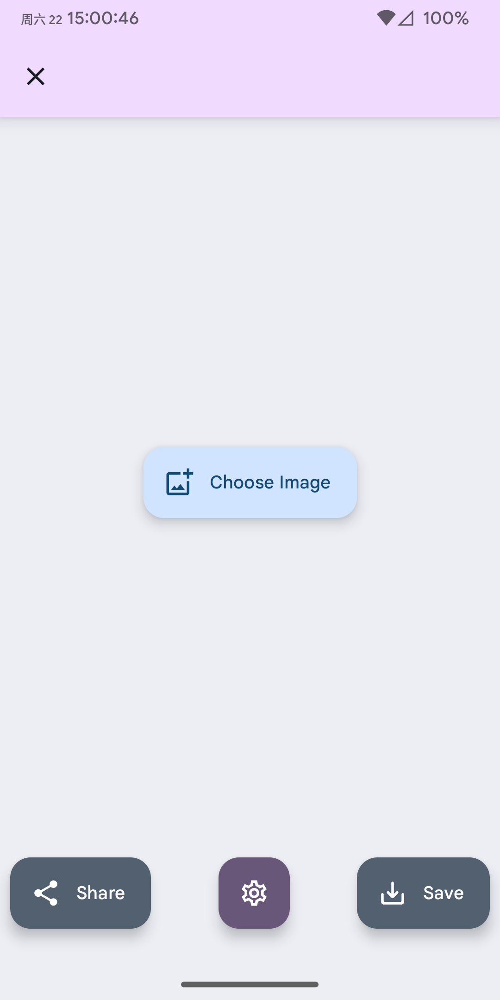
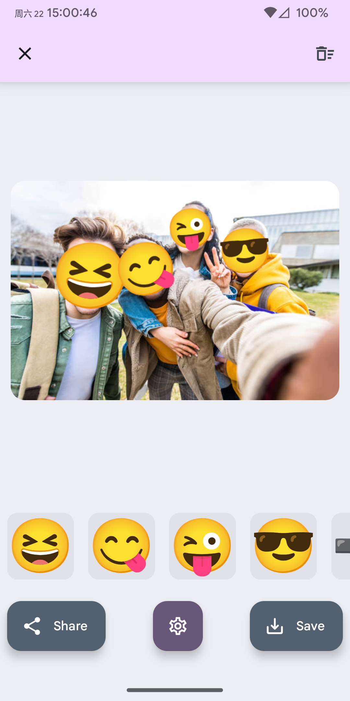

# FaceMoji

Reads images selected within the app or shared from other apps, detects faces in the images, and overlays them with emoji.

## Get

We offer two APK variants. Please choose the one that best fits your usage style:  

- `default`: The app icon is visible by default after installation. You can hide the icon from the in-app settings, but this might not work perfectly on all Android systems.  
- `icon-disabled`: The app icon is hidden by default after installation. This is the recommended choice if you primarily plan to use the app via the share menu from other applications. You can always unhide the icon later in the app's settings.  

|||
|:-:|:-:|

## Features

1. Automatically detects faces in images and applies a preset effect, with options for Emoji (default) or blur overlays.
2. Add, modify, or delete emoji or blur regions on images.
3. Multiple blur effects available, including Gaussian blur, pixelation, and halftone (with some deviations from standard definitions).
4. Option to hide the app icon (In this state, the only way to launch the app is by sharing a picture to it from another application.).
5. Import custom emoji font files.

## Notes

1. This application is "**provided AS IS**", without warranty of any kind.
2. The face recognition model has limitations and may occasionally misidentify or fail to detect faces.
3. All image processing is done **offline**.

## Acknowledgements

This project utilizes the following resources and projects:
1. Icons are modified from [Carnival Masks Pack](https://www.freepik.com/free-vector/carnival-masks-pack_832490.htm#fromView=search&page=1&position=25&uuid=19121ed9-3676-4304-a9af-fdd72fe1528c&query=Masquerade+mask+icon) by freepik.
2. Uses the pre-trained face detection model from [derronqi/yolov8-face](https://github.com/derronqi/yolov8-face).
