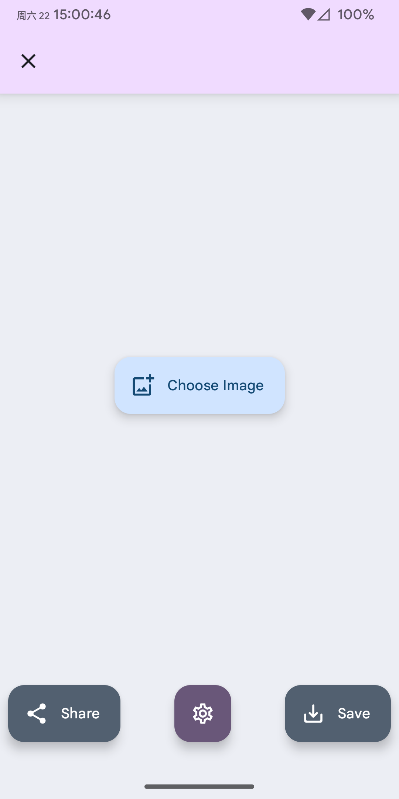
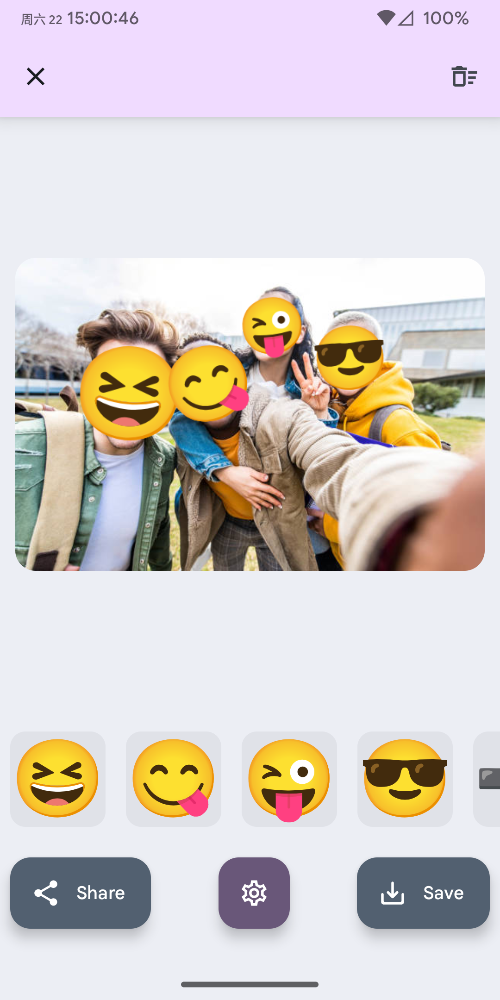

# FaceMoji

通过在应用选取或从其他应用分享的方式读取图片，识别图片中的人脸并以 Emoji 表情覆盖。  

|||
|:-:|:-:|

## 功能

1. 自动识别图片人脸并以 Emoji 表情覆盖
2. 在图片上添加、修改、删除 Emoji
3. 隐藏应用图标（此状态下只能从其他应用将图片分享到本应用）
4. 导入自定义 Emoji 字体文件

## 注意

1. 本应用「**按原样提供**」，不附带任何形式的担保。
2. 本应用所使用的人脸识别模型存在其性能限制，某些情况下可能存在误识别/未识别的情况。
3. 本应用所有处理均**离线**进行。

## 鸣谢

本项目依赖与以下资源和项目：
1. 本项目使用的图标来源于 [Carnival Masks Pack](https://www.freepik.com/free-vector/carnival-masks-pack_832490.htm#fromView=search&page=1&position=25&uuid=19121ed9-3676-4304-a9af-fdd72fe1528c&query=Masquerade+mask+icon) by freepik，进行了一定修改。
2. 本项目使用 [derronqi/yolov8-face](https://github.com/derronqi/yolov8-face) 提供的预训练模型进行人脸检测。

